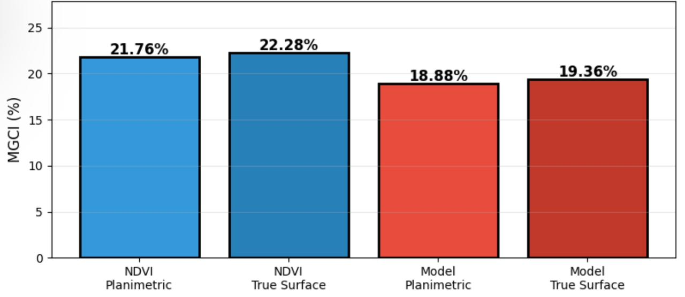
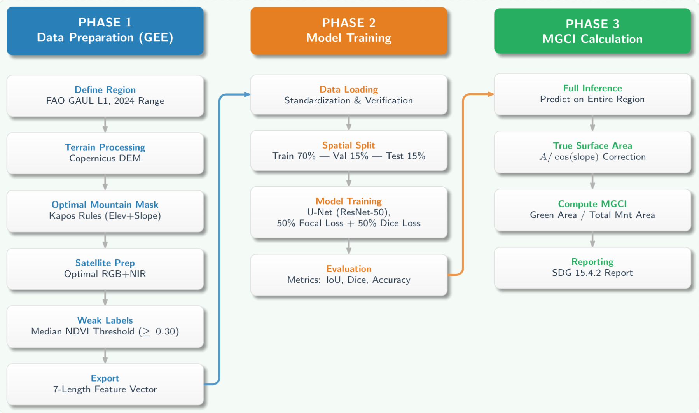
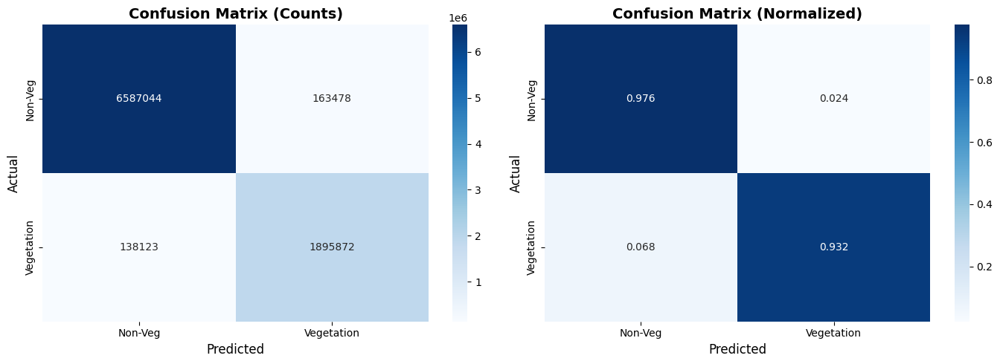
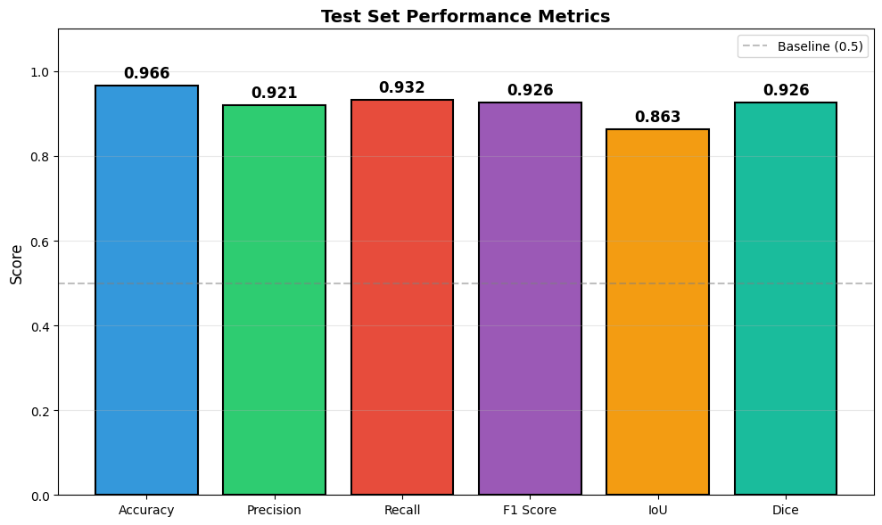
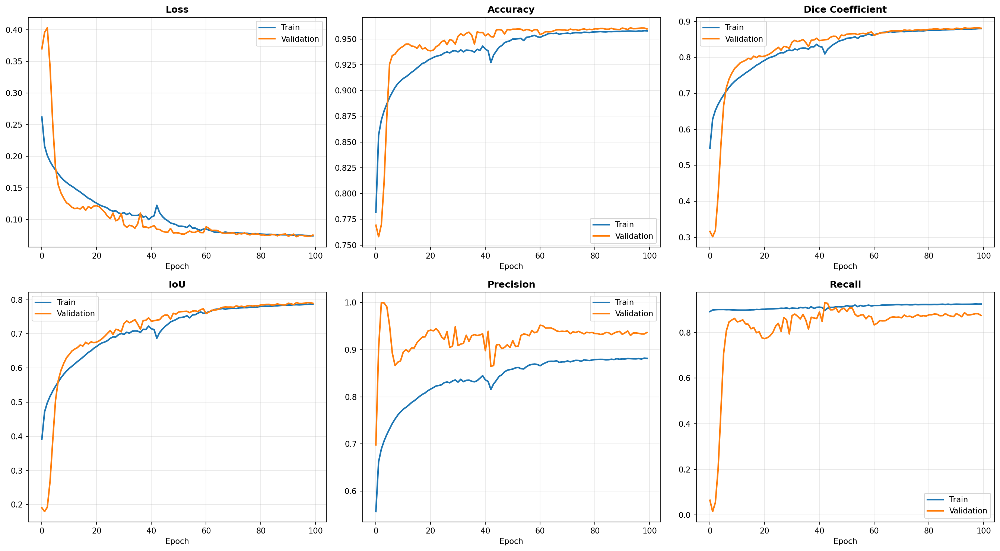
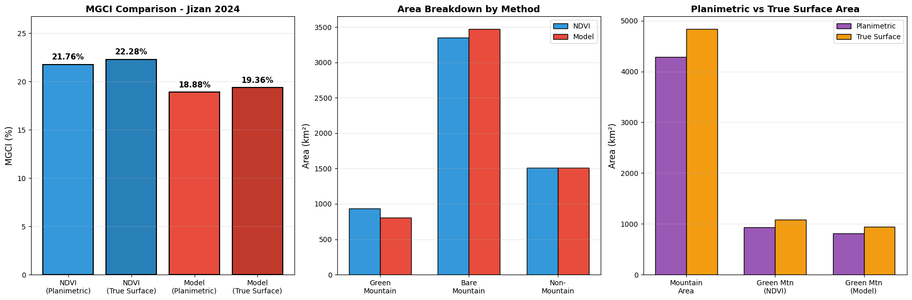
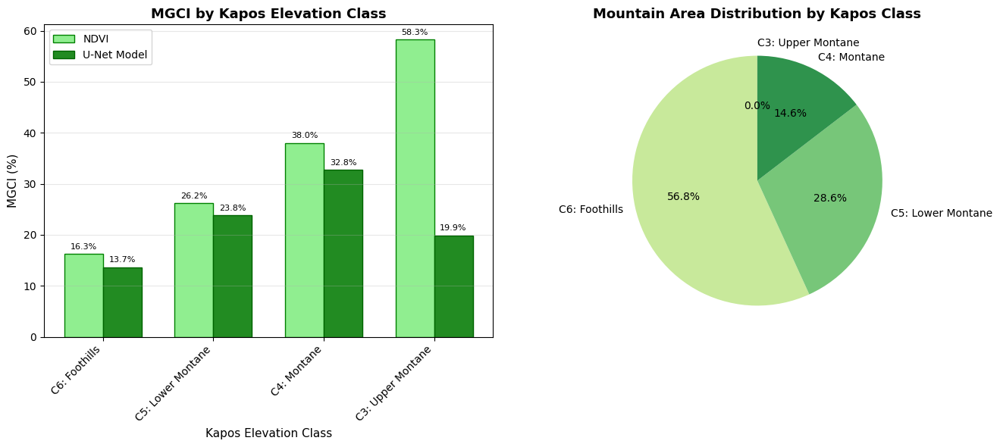
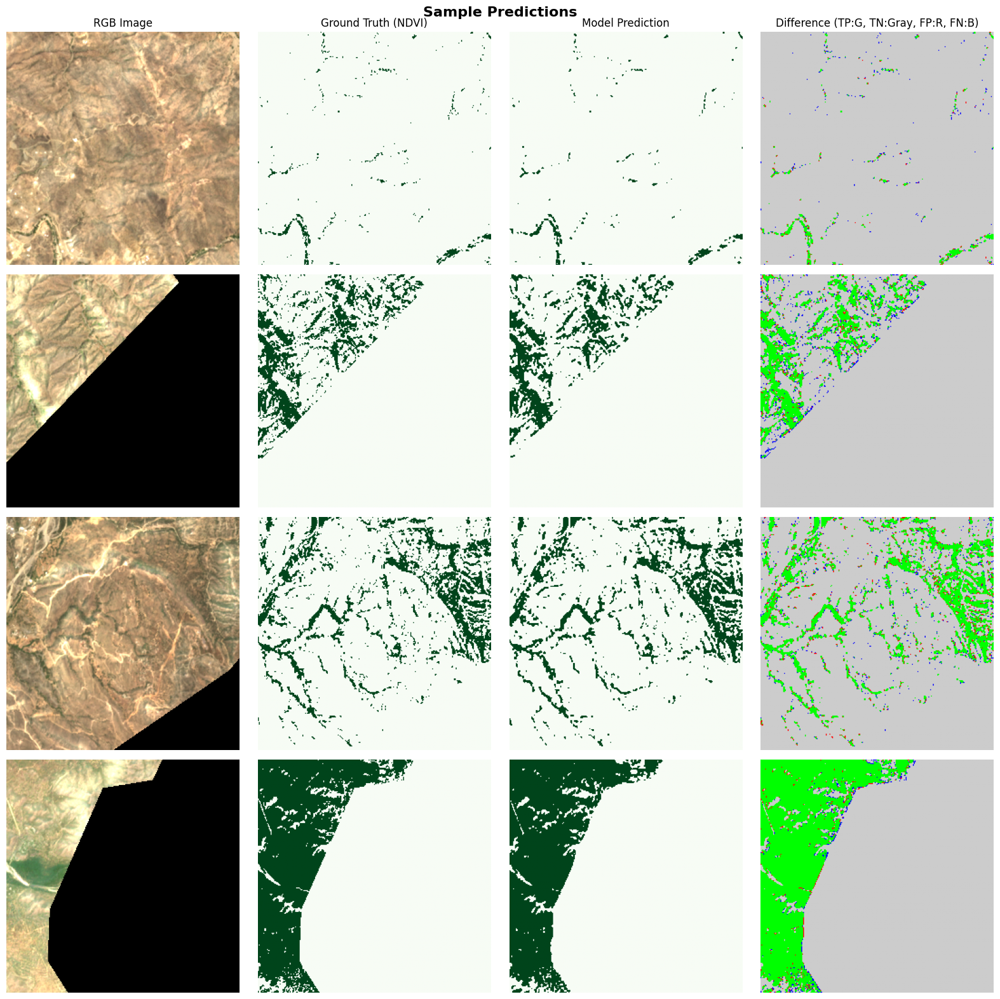

# Mountain Green Cover Index (MGCI) Using Deep Learning

[](LICENSE)
[](https://www.python.org/)
[](https://pytorch.org/)
[](https://earthengine.google.com/)

> **A Deep Learning Framework for Automated Vegetation Segmentation and SDG 15.4.2 Monitoring**

This repository provides a complete, reproducible pipeline for calculating the **Mountain Green Cover Index (MGCI)** — UN Sustainable Development Goal Indicator 15.4.2 — using deep learning and satellite remote sensing. The framework is **region-agnostic** and can be applied to any mountainous region worldwide.

<p align="center">
  
</p>

---

## Table of Contents

- [Overview](#overview)
- [Key Features](#key-features)
- [Quick Start](#quick-start)
- [Repository Structure](#repository-structure)
- [Detailed Pipeline](#detailed-pipeline)
  - [Phase 1: Data Export](#phase-1-data-export)
  - [Phase 2: Model Training](#phase-2-model-training)
  - [Phase 3: Inference & MGCI Calculation](#phase-3-inference--mgci-calculation)
- [Using Pre-trained Weights](#using-pre-trained-weights)
- [Applying to Your Region](#applying-to-your-region)
- [Results](#results)
- [Citation](#citation)
- [License](#license)
- [Acknowledgments](#acknowledgments)

---

## Overview

The Mountain Green Cover Index (MGCI) measures the percentage of mountain area covered by green vegetation. It is a key indicator for monitoring progress toward **SDG Target 15.4**: "Ensure the conservation of mountain ecosystems."

### Traditional vs. Deep Learning Approach

| Aspect | Traditional (NDVI Threshold) | Our Approach (U-Net) |
|--------|------------------------------|----------------------|
| Method | Fixed NDVI > 0.3 threshold | Learned semantic segmentation |
| Inputs | NIR and Red bands only | 6 bands (RGB, NIR, Elevation, Slope) |
| Context | Per-pixel, no spatial context | Spatial context via convolutions |
| Accuracy | Prone to false positives | Higher precision, fewer errors |

### What This Framework Provides

1. **Automated Data Pipeline** — Export satellite data for any region using Google Earth Engine
2. **Deep Learning Model** — U-Net with ResNet-50 encoder for vegetation segmentation
3. **MGCI Calculation** — Both planimetric and true surface area methods
4. **Kapos Stratification** — Results broken down by elevation class
5. **Pre-trained Weights** — Ready-to-use model for immediate inference

<p align="center">
  
</p>

---

## Key Features

- **Region-Agnostic**: Apply to any country or administrative region
- **Fully Reproducible**: Step-by-step notebooks with clear instructions
- **Multiple MGCI Methods**: Compare NDVI threshold vs. model predictions
- **True Surface Area**: Slope-corrected area calculations
- **Kapos Classification**: Results stratified by elevation class (300m to 4500m+)
- **Publication-Ready Figures**: Automated visualization generation
- **Pre-trained Weights**: Use our model or train your own

---

## Quick Start

### Option A: Use Pre-trained Weights (Fastest)

```bash
# 1. Clone the repository
git clone https://github.com/QEC-Team/MGCI-Deep-Learning.git
cd MGCI-Deep-Learning

# 2. Download pre-trained weights (see weights/README.md)

# 3. Open notebooks in Google Colab:
#    - Run Notebook 1 to export data for YOUR region
#    - Skip Notebook 2 (training)
#    - Run Notebook 3 for inference using pre-trained weights
```

### Option B: Train Your Own Model

```bash
# 1. Clone the repository
git clone https://github.com/QEC-Team/MGCI-Deep-Learning.git
cd MGCI-Deep-Learning

# 2. Open notebooks in Google Colab:
#    - Run Notebook 1 to export data
#    - Run Notebook 2 to train the model
#    - Run Notebook 3 for inference
```

---

## Repository Structure

```
MGCI-Deep-Learning/
│
├── README.md                          # This file
├── LICENSE                            # CC BY-NC-ND 4.0 License
├── CITATION.cff                       # Citation information
├── requirements.txt                   # Python dependencies
├── .gitignore                         # Git ignore rules
│
├── notebooks/
│   ├── MGCI_1_DataExport.ipynb       # Phase 1: Google Earth Engine export
│   ├── MGCI_2_Training.ipynb         # Phase 2: Model training
│   └── MGCI_3_Inference.ipynb        # Phase 3: Inference & MGCI calculation
│
├── weights/
│   └── README.md                      # Instructions for downloading weights
│
├── docs/
│   ├── SETUP.md                       # Detailed setup guide
│   ├── DATA_PREPARATION.md            # Region-specific data preparation
│   ├── METHODOLOGY.md                 # Technical methodology details
│   └── TROUBLESHOOTING.md             # Common issues and solutions
│
├── figures/
│   ├── pipeline_overview.png          # Pipeline diagram
│   ├── model_architecture.png         # U-Net architecture
│   ├── sample_results.png             # Example outputs
│   └── kapos_classification.png       # Elevation class diagram
│
└── examples/
    └── region_configs/                # Example configurations for regions
        ├── saudi_arabia_jazan.py
        └── template.py
```

---

## Detailed Pipeline

### Phase 1: Data Export

**Notebook:** `MGCI_1_DataExport.ipynb`

This notebook uses Google Earth Engine to export satellite data for your region of interest.

#### Data Sources

| Data | Source | Resolution | Purpose |
|------|--------|------------|---------|
| Optical Imagery | Sentinel-2 L2A | 10m | RGB + NIR bands |
| Elevation | Copernicus GLO-30 DEM | 30m (resampled to 10m) | Mountain classification |
| Slope | Derived from DEM | 10m | Surface area correction |
| Administrative Boundaries | FAO GAUL | Vector | Region selection |

#### Exported Bands

| Index | Band | Source | Description |
|-------|------|--------|-------------|
| 0 | Blue | Sentinel-2 B2 | Blue reflectance (0-10000) |
| 1 | Green | Sentinel-2 B3 | Green reflectance (0-10000) |
| 2 | Red | Sentinel-2 B4 | Red reflectance (0-10000) |
| 3 | NIR | Sentinel-2 B8 | Near-infrared reflectance (0-10000) |
| 4 | Elevation | Copernicus DEM | Elevation in meters |
| 5 | Slope | Derived | Slope in degrees (0-90) |
| 6 | VegLabel | NDVI threshold | Binary vegetation label (0/1) |

#### Key Parameters to Modify

```python
# In the Config class:
COUNTRY = 'Saudi Arabia'           # Your country
REGION = 'Jazan'                   # Your region/province
YEAR = 2024                        # Year of analysis
CLOUD_COVER_MAX = 20               # Maximum cloud cover percentage
NDVI_THRESHOLD = 0.30              # Vegetation threshold
MOUNTAIN_THRESHOLD = 300           # Minimum elevation (meters)
PATCH_SIZE = 2560                  # Patch size in meters
```

#### Output

- GeoTIFF patches (7 bands each) saved to Google Drive
- Each patch covers ~2.56 × 2.56 km at 10m resolution (256 × 256 pixels)

---

### Phase 2: Model Training

**Notebook:** `MGCI_2_Training.ipynb`

This notebook trains a U-Net model for vegetation segmentation.

#### Model Architecture

```
U-Net with ResNet-50 Encoder
├── Encoder: ResNet-50 (ImageNet pre-trained)
├── Decoder: U-Net decoder blocks
├── Input: 6 channels (Blue, Green, Red, NIR, Elevation, Slope)
├── Output: 1 channel (vegetation probability)
└── Parameters: ~32.5 million
```

#### Training Configuration

| Parameter | Value | Description |
|-----------|-------|-------------|
| Optimizer | AdamW | Adaptive optimizer with weight decay |
| Learning Rate | 3×10⁻⁴ | Initial learning rate |
| Weight Decay | 1×10⁻⁴ | L2 regularization |
| Batch Size | 8 | Samples per batch |
| Epochs | 80 | Maximum training epochs |
| Early Stopping | 15 | Patience (epochs without improvement) |
| Loss Function | 0.5×Focal + 0.5×Dice | Combined loss for class imbalance |
| Scheduler | CosineAnnealingWarmRestarts | Learning rate schedule |

#### Data Augmentation

| Augmentation | Probability | Purpose |
|--------------|-------------|---------|
| Horizontal Flip | 0.5 | Spatial invariance |
| Vertical Flip | 0.5 | Spatial invariance |
| Random Rotate 90° | 0.5 | Rotational invariance |
| Shift/Scale/Rotate | 0.5 | Geometric robustness |
| Gaussian Noise | 0.3 | Noise robustness |
| Brightness/Contrast | 0.3 | Radiometric robustness |

#### Data Split

The data is split **spatially** (sorted by longitude) to prevent data leakage:

| Split | Percentage | Purpose |
|-------|------------|---------|
| Train | 70% | Model training |
| Validation | 15% | Hyperparameter tuning |
| Test | 15% | Final evaluation |

#### Output

- `model_best.pth` — Saved model weights
- Training history plots
- Confusion matrix
- Sample predictions

---

### Phase 3: Inference & MGCI Calculation

**Notebook:** `MGCI_3_Inference.ipynb`

This notebook runs inference on all patches and calculates MGCI.

#### MGCI Formula

$$\text{MGCI} = \frac{\text{Green Mountain Area}}{\text{Total Mountain Area}} \times 100\%$$

#### Methods Compared

| Method | Description |
|--------|-------------|
| NDVI Planimetric | Traditional NDVI > 0.3 threshold, flat area |
| NDVI True Surface | NDVI threshold with slope-corrected area |
| Model Planimetric | U-Net predictions, flat area |
| Model True Surface | U-Net predictions with slope-corrected area |

#### True Surface Area Correction

For sloped terrain, the true surface area is larger than the planimetric (map) area:

$$\text{True Surface Area} = \frac{\text{Planimetric Area}}{\cos(\text{slope})}$$

#### Kapos Elevation Classes

| Class | Name | Elevation Range |
|-------|------|-----------------|
| 6 | Foothills | 300 – 1,000 m |
| 5 | Lower Montane | 1,000 – 1,500 m |
| 4 | Montane | 1,500 – 2,500 m |
| 3 | Upper Montane | 2,500 – 3,500 m |
| 2 | Alpine | 3,500 – 4,500 m |
| 1 | Nival | > 4,500 m |

#### Output

- `mgci_results.json` — Complete MGCI results
- `mgci_by_kapos_class.json` — Results by elevation class
- Publication-ready figures

---

## Using Pre-trained Weights

We provide pre-trained weights that can be used directly for inference on new regions.

### Download Weights

See [`weights/README.md`](weights/README.md) for download instructions.

### Model Details

| Property | Value |
|----------|-------|
| Architecture | U-Net + ResNet-50 |
| Input Channels | 6 |
| Training Region | Jazan, Saudi Arabia |
| Training Patches | 878 |
| Best Epoch | 68 |
| Validation IoU | 0.8475 |
| Test Dice | 0.9263 |

### Using Pre-trained Weights

In Notebook 3, simply point to the downloaded weights:

```python
Config.MODEL_PATH = '/path/to/model_best.pth'
```

The model will load and run inference on your exported patches.

---

## Applying to Your Region

### Step-by-Step Guide

#### 1. Choose Your Region

Select any administrative region available in the FAO GAUL database:
- Country level (e.g., "Switzerland")
- Province/State level (e.g., "Colorado")
- District level (e.g., "Zermatt")

#### 2. Modify Notebook 1 Configuration

```python
class Config:
    # Change these for your region
    COUNTRY = 'Your Country'
    REGION = 'Your Region'
    
    # Adjust based on your region's characteristics
    YEAR = 2024
    CLOUD_COVER_MAX = 20
    NDVI_THRESHOLD = 0.30
    MOUNTAIN_THRESHOLD = 300  # Kapos minimum
    
    # Adjust date range for your region's growing season
    START_DATE = '2024-01-01'
    END_DATE = '2024-12-31'
```

#### 3. Run the Pipeline

| Step | Notebook | Time (Approx.) |
|------|----------|----------------|
| 1 | Export Data | 12-48 hours (depends on region size) |
| 2 | Train Model | 1-2 hours (GPU recommended) |
| 3 | Run Inference | 5-10 minutes |

#### 4. Interpret Results

The output JSON files contain:
- Total mountain area (km²)
- Green mountain area (km²)
- MGCI values for each method
- Results stratified by Kapos class

### Regional Considerations

| Region Type | Considerations |
|-------------|----------------|
| Tropical | Adjust date range to avoid monsoon; may need lower cloud threshold |
| Arid | NDVI threshold may need adjustment; sparse vegetation |
| Alpine | High elevation classes will be populated |
| Temperate | Consider seasonal variation; growing season dates important |

---

## Results

### Model Performance (Test Set)

| Metric | Value |
|--------|-------|
| Accuracy | 96.57% |
| Precision | 92.06% |
| Recall | 93.21% |
| F1 Score | 92.63% |
| IoU | 86.28% |
| Dice | 92.63% |

<p align="center">
  
  
</p>

### Training History

<p align="center">
  
</p>

### MGCI Results (Jazan, Saudi Arabia)

| Method | MGCI (%) |
|--------|----------|
| NDVI (Planimetric) | 21.76% |
| NDVI (True Surface) | 22.28% |
| Model (Planimetric) | 18.88% |
| Model (True Surface) | 19.36% |

<p align="center">
  
</p>

### MGCI by Elevation Class

<p align="center">
  
</p>

### Key Findings

- Model predictions are more conservative than NDVI threshold
- True surface area correction adds ~0.5% to MGCI values
- Model reduces false positives in bare soil and rocky areas

<p align="center">
  
</p>

---

## Citation

If you use this code or methodology in your research, please cite:

```bibtex
@software{mgci_deep_learning_2024,
  author = {Alorf, Abdulaziz and Alsultan, Muhannad and Alghonaim, Thamer and Alwazzan, Bandar},
  title = {MGCI-Deep-Learning: A Framework for Mountain Green Cover Index Calculation Using Deep Learning},
  year = {2024},
  publisher = {GitHub},
  url = {https://github.com/QEC-Team/MGCI-Deep-Learning}
}
```

**Publication (In Preparation):**

> Alorf, A., Alsultan, M., Alghonaim, T., & Alwazzan, B. (2024). Developing a National Framework for Estimating Mountain Green Cover Using Deep Learning and Satellite Remote Sensing. *Manuscript in preparation*.

---

## License

This project is licensed under the **Creative Commons Attribution-NonCommercial-NoDerivatives 4.0 International License (CC BY-NC-ND 4.0)**.

### You are free to:
- **Share** — Copy and redistribute the material in any medium or format

### Under the following terms:
- **Attribution** — You must give appropriate credit and cite this work
- **NonCommercial** — You may not use the material for commercial purposes
- **NoDerivatives** — You may not distribute modified versions

See [LICENSE](LICENSE) for the full license text.

---

## Acknowledgments

- **Google Earth Engine** — Satellite data access and processing
- **European Space Agency** — Sentinel-2 imagery
- **Copernicus Programme** — GLO-30 DEM
- **FAO** — GAUL administrative boundaries and MGCI methodology

---

## Contact

For questions or collaboration inquiries, please open an issue on this repository.

---

<p align="center">
  <b>MGCI Deep Learning Framework</b>
</p>
